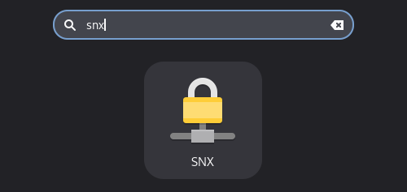

# :lock: SNX VPN Wrapper
Python tray app wrapper for `snx` VPN process.

## :gear: Setup

### Clone

Open terminal, change your current working directory to the location where you want the cloned directory and then clone this repository to your local machine

```
git clone https://github.com/dmitreiro/snx-wrapper.git
```

### Installation

1) For the first step, you will need to install and configure `snx`. You can check instructions [here](INSTALL_SNX.md).

:warning: **Warning**: before you proceed, check [dependencies](#dependencies)!

2) Copy `snx_wrapper.py` from `src` folder to `~/.local/share/applications`
```
cp src/snx_wrapper.py ~/.local/bin/
```

3) Then, create a **snx_wrapper.desktop** file in `~/.local/share/applications` to generate a desktop app icon, replacing **user** by your Linux user

```
[Desktop Entry]
Name=SNX
Exec=/usr/bin/python3 /home/user/.local/bin/snx_wrapper.py
Icon=network-vpn
Type=Application
Categories=Settings;Network
Terminal=false
```

4) (**optional**) If you want it to start automatically during startup, create a link to `~/.config/autostart/`, replacing **user** by your Linux user
```
ln -s /home/user/.local/share/applications/snx_wrapper.desktop /home/user/.config/autostart/snx_wrapper.desktop
```

To force desktop apps database to refresh, run
```
update-desktop-database ~/.local/share/applications/
```

You are now ready to rock! :sunglasses:

Just seach for **snx** and it will appear on the applications menu



### Dependencies

Make sure you have **Python 3.9+**! Check you Python version by running `python -V`

From your repository home folder, install Python dependencies

```
pip install -r requirements.txt
```

## :page_with_curl: Usage

When you run the app, it will stay running on background. To connect or disconnect `snx`, go to the app tray icon and select either `Connect` or `Disconnect` options.

For connection, there will be a prompt window asking for your password.

**Note:** Remember, for this to work, you must have `snx` process fully functional and configurations ready in `~/.snxrc` file!

## :hammer_and_wrench: Contributing

Contributions are welcome and greatly appreciated!
Whether it’s fixing a bug, improving documentation, or adding new features — all help is valuable.

## :balance_scale: License

This project is licensed under the MIT License, which allows anyone to use, modify, and distribute this software for free, as long as the original copyright and license notice are included. See the [LICENSE](LICENSE) file for more details.
